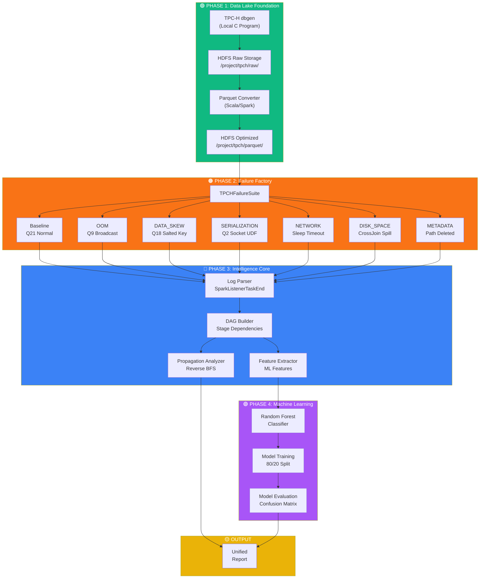

# Spark Failure Propagation & Root-Cause Analytics

[](https://www.scala-lang.org/)
[](https://spark.apache.org/)
[](https://hadoop.apache.org/)
[](https://spark.apache.org/docs/latest/api/python/)
[](https://docs.docker.com/compose/)

> **Distributed Systems Engineering • Root-Cause Analytics • Applied Machine Learning**
>
> A reproducible distributed systems platform that reconstructs Apache Spark execution DAGs, performs dependency-aware root-cause tracing using Reverse BFS, and classifies failure scenarios from execution telemetry.

---

## Execution Environment

> This project is designed to run entirely inside the provided Docker environment.
>
> Spark, Hadoop (HDFS/YARN), and supporting services communicate through Docker's internal network. Running the pipeline directly from the host operating system is not supported.
> 
> - **Scala Preprocessing** runs directly on the Spark cluster.
> - **Python ML Scripts and Jupyter Notebooks** require a separate Python environment (such as Google Colab, Databricks, or a local Jupyter installation) because the provided Docker cluster is optimized strictly for Scala/Spark.

---

## Why This Project

When a Spark job fails on a multi-stage DAG, the terminal error message is often a symptom — not the cause. A failed shuffle stage propagates downstream, triggering cascading aborts in dependent stages. Engineers manually trace these dependency chains to find the root cause.

This project automates that process:

### Features
- **Reverse BFS Algorithm**: Traverses the DAG from terminal failure up to the earliest failed stage to identify the true root cause.
- **Machine Learning Classification**: Extracts 25 features and uses a Random Forest classifier to categorize failures into 7 distinct scenarios.
- **Automated Failure Injection**: Includes a framework to deterministically simulate OOM, Data Skew, Network Timeouts, and more for generating labeled datasets.


---

## Architecture



---

## Engineering Highlights

- **Reverse BFS** with logical abort filtering to trace root causes through multi-stage dependency chains
- **True DAG reconstruction** from Spark's `Parent IDs` field — not heuristic stage ordering
- **Distributed telemetry processing** — log parsing and feature extraction run on Spark itself
- **25-feature engineering** covering runtime behavior, structural characteristics, and derived ratios
- **Confound analysis** — verified that the model learns execution behavior, not query fingerprints (3 confounded features removed with no performance drop)
- **7 failure injection scenarios** with TPC-H benchmark queries on YARN

---

## Quick Start

### Prerequisites

- Docker Desktop (16GB+ RAM allocated)
- Java 11+
- sbt 1.9.x

### Step 1: Initialize Cluster & Build
Start the Hadoop/Spark ecosystem and compile the Scala pipeline:
```bash
docker compose up -d
sbt clean assembly
docker cp target/scala-2.12/spark-rca-assembly.jar spark-shell:/opt/spark/jars/
```

### Step 2: Data Ingestion & Conversion
Generate TPC-H data and convert it to Parquet inside HDFS:
```bash
docker exec spark-shell /opt/spark/bin/spark-submit \
  --master yarn --class com.sparkrca.Main \
  /opt/spark/jars/spark-rca-assembly.jar convert
```

### Step 3: Run the Pipeline
Execute the failure injection campaign and batch preprocessing (Log Parsing, DAG Reconstruction, Reverse BFS, Feature Extraction):
```bash
# Run failure injection (80 applications)
docker exec spark-shell /opt/spark/bin/spark-submit \
  --master yarn --class com.sparkrca.injection.CampaignRunner \
  /opt/spark/jars/spark-rca-assembly.jar

# Preprocess logs and extract features
docker exec spark-shell /opt/spark/bin/spark-submit \
  --master yarn --class com.sparkrca.PreprocessRunner \
  /opt/spark/jars/spark-rca-assembly.jar
```

### Step 4: Train ML Models
Train and evaluate the Random Forest classifier on the extracted features using the Jupyter Notebook:
Open Google Colab, Databricks, or a local Jupyter environment and execute the notebook located at:
`research/notebooks/spark_rca_ml.ipynb`

> **Note**: The Docker container is strictly a JVM environment for Scala preprocessing. Python is intentionally excluded from the cluster to save resources. You must download the generated `features.parquet` file and run the notebook in a separate Python environment with PySpark and scikit-learn installed.

---

## Results

| Metric | Random Forest (25 features) |
|--------|---------------------------------------|
| Accuracy | ≈ 88.2% |
| Weighted Precision | ≈ 0.93 |
| Weighted Recall | ≈ 0.88 |
| Weighted F1 | ≈ 0.8676 |
| 5-Fold CV F1 | ≈ 0.9507 |
| 5-Fold CV Accuracy | ≈ 96.1% |

### Key Findings

- **Reverse BFS** successfully localized dependency-aware root causes across all evaluated failure scenarios.
- **Confound analysis** showed that removing 3 structurally-confounded features (`total_stages`, `stage_depth_of_failure`, `peak_memory_ratio`) slightly improved held-out F1 (0.8676 → 0.8725), demonstrating the retained features reflect genuine execution behavior rather than query-specific artifacts.
- **Runtime telemetry features** were more informative than workflow structure for failure classification.

---

## Research Validation

This project includes additional validation beyond model evaluation:

- **Ablation Study** – Evaluated the contribution of engineered telemetry features to model performance.
- **Confound Analysis** – Removed query-structural features (`total_stages`, `stage_depth_of_failure`, `peak_memory_ratio`) to verify the model learned runtime execution behavior rather than query fingerprints.

Detailed methodology and results are available in the Technical Documentation.

---

## Technical Documentation

| Document | Contents |
|----------|----------|
| [Architecture](docs/architecture.md) | System design, data flow, component details |
| [Engineering Decisions](docs/engineering-decisions.md) | Why Reverse BFS, Why not GraphX, Why RF, Why Scala |
| [Experimental Design](docs/experimental-design.md) | Dataset, splits, cross-validation, evaluation protocol |
| [Model Comparison](docs/model-comparison.md) | Random Forest vs Decision Tree vs Logistic Regression |
| [Ablation Study](docs/ablation-study.md) | Feature importance and group contribution analysis |
| [Confound Analysis](docs/confound-analysis.md) | Query fingerprint leakage investigation |
| [Limitations & Future Work](docs/limitations.md) | Known constraints and future directions |

---

## Repository Structure

```text
├── src/            Core Scala pipeline (DAG reconstruction, Reverse BFS, telemetry)
├── research/       PySpark ML pipelines and Jupyter notebooks for analysis
├── docs/           Technical documentation and engineering decisions
├── scripts/        Infrastructure scripts for data generation and HDFS ingestion
├── configs/        Configuration overrides for the YARN scheduler
└── results/        Output directory for ML models and evaluation metrics
```

---

## Why These Technologies

| Technology | Why |
|------------|-----|
| **Apache Spark** | Distributed event log parsing and feature extraction at scale |
| **Scala** | High-performance, type-safe implementation of the data pipeline |
| **HDFS / YARN** | Large-scale telemetry storage and robust cluster resource management |
| **Spark MLlib** | Distributed ML training over massively parallel data partitions |
| **Python** | Rapid prototyping and experimental confound analysis |
| **Docker Compose** | Single-command reproducible cluster environment |

---
