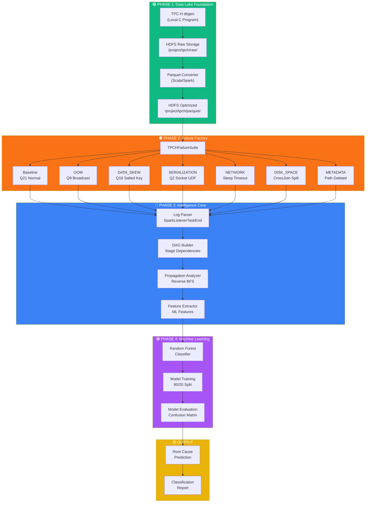

# Architecture

## System Architecture

This document describes the technical architecture of the Spark Root Cause Analysis (RCA) system.

---

## High-Level Pipeline



---

## Component Details

### Phase 1: Data Lake Foundation

**Purpose**: Establish a realistic Big Data environment with optimized storage.

```
┌─────────────────────────────────────────────────────────────┐
│                    DATA LAKE LAYER                           │
├─────────────────────────────────────────────────────────────┤
│  ┌─────────────┐    ┌─────────────┐    ┌─────────────────┐ │
│  │   dbgen     │───▶│  HDFS Raw   │───▶│ Parquet Tables  │ │
│  │ (10GB TPC-H)│    │ (.tbl files)│    │ (Columnar)      │ │
│  └─────────────┘    └─────────────┘    └─────────────────┘ │
│                                                              │
│  Tables: customer, lineitem, nation, orders,                │
│          part, partsupp, region, supplier                   │
└─────────────────────────────────────────────────────────────┘
```

**Key Components**:
- `HDFSUtils.scala`: File operations, path validation, size queries
- `TPCHParquetConverter.scala`: Schema definitions, text-to-Parquet conversion

---

### Phase 2: Failure Factory

**Purpose**: Generate labeled training data with realistic Deep DAG failures.

```
┌──────────────────────────────────────────────────────────────────┐
│                     FAILURE INJECTION LAYER                       │
├──────────────────────────────────────────────────────────────────┤
│                                                                   │
│  Label 0: BASELINE        ─── TPC-H Q21 (Normal Execution)       │
│  Label 1: OUT_OF_MEMORY   ─── Q9 + BROADCAST(lineitem)           │
│  Label 2: DATA_SKEW       ─── Q18 + 99% Key Skew                 │
│  Label 3: SERIALIZATION   ─── Q2 + Socket in Closure             │
│  Label 4: NETWORK_TIMEOUT ─── Q1 + Sleep > Heartbeat             │
│  Label 5: DISK_SPACE      ─── CrossJoin Massive Spill            │
│  Label 6: METADATA        ─── Iterative + Path Deletion          │
│                                                                   │
└──────────────────────────────────────────────────────────────────┘
                              │
                              ▼
                   ┌──────────────────────┐
                   │   Spark Event Logs   │
                   │  (JSON Lines Format) │
                   └──────────────────────┘
```

**Key Components**:
- `FailureScenarios.scala`: Sealed trait hierarchy for type-safe failure handling
- `TPCHFailureSuite.scala`: 6 TPC-H query implementations with failure injection

---

### Phase 3: Intelligence Core

**Purpose**: Mathematical reconstruction of failure chains and feature extraction.

```
┌──────────────────────────────────────────────────────────────────┐
│                    PREPROCESSING PIPELINE                         │
├──────────────────────────────────────────────────────────────────┤
│                                                                   │
│  ┌──────────────┐   ┌──────────────┐   ┌──────────────────────┐ │
│  │ Log Parser   │──▶│ DAG Builder  │──▶│ Propagation Analyzer │ │
│  │              │   │              │   │                      │ │
│  │ Extracts:    │   │ Builds:      │   │ Algorithm:           │ │
│  │ - Task End   │   │ - Parent IDs │   │ REVERSE BFS          │ │
│  │ - Duration   │   │ - Child IDs  │   │                      │ │
│  │ - Spill      │   │ - Status     │   │ 1. Start at terminal │ │
│  │ - Shuffle    │   │              │   │ 2. Traverse parents  │ │
│  └──────────────┘   └──────────────┘   │ 3. Stop when no      │ │
│                                         │    failed parents    │ │
│                                         └──────────────────────┘ │
│                                                     │            │
│                                                     ▼            │
│                                         ┌──────────────────────┐ │
│                                         │ Feature Extractor    │ │
│                                         │                      │ │
│                                         │ Features:            │ │
│                                         │ - duration_hetero.   │ │
│                                         │ - spill_ratio        │ │
│                                         │ - gc_time_ratio      │ │
│                                         │ - task_failure_rate  │ │
│                                         └──────────────────────┘ │
└──────────────────────────────────────────────────────────────────┘
```

#### Reverse BFS Algorithm

```
ALGORITHM: Root Cause Identification via Reverse BFS

INPUT:  DAG with stages and failure statuses
OUTPUT: Root Cause Stage ID

1. FIND terminal_failed_stage = leaf stage with FAILED status
2. INITIALIZE queue with [terminal_failed_stage]
3. INITIALIZE visited = {}

4. WHILE queue is not empty:
     current = queue.dequeue()
     IF current in visited: CONTINUE
     visited.add(current)
     
     parents = get_parent_stages(current)
     failed_parents = filter(parents, status=FAILED AND NOT logical_abort)
     
     IF failed_parents is EMPTY:
         RETURN current  # This is the ROOT CAUSE
     ELSE:
         FOR each parent in failed_parents:
             queue.enqueue(parent)
             mark current as VICTIM

5. RETURN first stage in queue (fallback)
```

---

### Phase 4: Machine Learning

**Purpose**: Train and evaluate Random Forest classifier for root cause prediction.

```
┌──────────────────────────────────────────────────────────────────┐
│                      ML PIPELINE                                  │
├──────────────────────────────────────────────────────────────────┤
│                                                                   │
│  ┌────────────────┐                                              │
│  │ Feature Vector │                                              │
│  │ (25 features)  │                                              │
│  └───────┬────────┘                                              │
│          │                                                        │
│          ▼                                                        │
│  ┌────────────────┐    ┌─────────────┐    ┌─────────────────┐   │
│  │  Train/Test    │───▶│   Random    │───▶│   Predictions   │   │
│  │  Split (80/20) │    │   Forest    │    │   + Evaluation  │   │
│  └────────────────┘    │             │    └─────────────────┘   │
│                        │ Trees: 100  │                           │
│                        │ Depth: 10   │                           │
│                        └─────────────┘                           │
│                                                                   │
│  Evaluation Metrics:                                             │
│  - Per-class Precision, Recall, F1                               │
│  - Confusion Matrix                                              │
│  - Feature Importances                                           │
└──────────────────────────────────────────────────────────────────┘
```

---

## Data Flow

```
                    ┌─────────────┐
                    │  TPC-H Raw  │
                    │   (~25GB)   │
                    └──────┬──────┘
                           │
              ┌────────────┴────────────┐
              │      Spark Job          │
              │   (YARN Cluster Mode)   │
              └────────────┬────────────┘
                           │
         ┌─────────────────┼─────────────────┐
         │                 │                 │
         ▼                 ▼                 ▼
   ┌──────────┐     ┌──────────┐     ┌──────────┐
   │ Parquet  │     │  Event   │     │  Parsed  │
   │  Tables  │     │   Logs   │     │ Features │
   └──────────┘     └──────────┘     └──────────┘
                           │                 │
                           └────────┬────────┘
                                    │
                                    ▼
                           ┌────────────────┐
                           │ Trained Model  │
                           │   (RF Model)   │
                           └────────────────┘
                                    │
                                    ▼
                           ┌────────────────┐
                           │  Predictions   │
                           │  Root Cause    │
                           │    Labels      │
                           └────────────────┘
```

---

## HDFS Directory Structure

```
/project/
├── tpch/
│   ├── raw/                    # TPC-H .tbl files
│   │   ├── customer.tbl
│   │   ├── lineitem.tbl
│   │   ├── nation.tbl
│   │   ├── orders.tbl
│   │   ├── part.tbl
│   │   ├── partsupp.tbl
│   │   ├── region.tbl
│   │   └── supplier.tbl
│   └── parquet/                # Optimized Parquet tables
│       ├── customer/
│       ├── lineitem/
│       └── ...
├── spark-logs/                 # Spark event log files
│   ├── baseline/               # Per-scenario subfolders
│   ├── oom/
│   ├── skew/
│   ├── serialization/
│   ├── metadata/
│   ├── disk/
│   └── network/
├── preprocess/                 # Preprocessing pipeline outputs
│   ├── task_metrics.parquet
│   ├── stage_metrics.parquet
│   ├── dag_edges.parquet
│   ├── root_causes.parquet
│   ├── features.parquet
│   ├── ground_truth.parquet
│   ├── train.parquet
│   └── test.parquet
├── features/                   # Extracted ML features
└── models/                     # Trained RF models
```

---

## Configuration Reference

### SparkConfig Constants

| Path Constant | HDFS Path |
|---------------|-----------|
| `TPCH_RAW` | `/project/tpch/raw` |
| `TPCH_PARQUET` | `/project/tpch/parquet` |
| `EVENT_LOGS` | `/project/spark-logs` |
| `ML_MODELS` | `/project/models` |
| `EXTRACTED_FEATURES` | `/project/features` |
| `PREPROCESS` | `/project/preprocess` |

### Label Constants

| Label | Constant | Name |
|-------|----------|------|
| 0 | `BASELINE` | Normal Execution |
| 1 | `OUT_OF_MEMORY` | OOM Failure |
| 2 | `DATA_SKEW` | Straggler Tasks |
| 3 | `SERIALIZATION` | Task Not Serializable |
| 4 | `NETWORK_TIMEOUT` | ExecutorLost |
| 5 | `DISK_SPACE` | No Space Left |
| 6 | `METADATA_FAILURE` | FileNotFoundException |

---

## Performance Considerations

1. **Parquet Format**: Columnar storage reduces I/O for analytical queries
2. **Event Log Compression**: Disabled (`spark.eventLog.compress=false`) for reliable parsing
3. **Adaptive Query Execution**: Enabled for dynamic optimization
4. **Kryo Serialization**: Used for faster object serialization
5. **Log4j Configuration**: Silences Spark verbosity to improve log analysis

---

## Error Handling

- **HDFS Path Validation**: All paths are validated before operations
- **JSON Parsing**: Try-catch blocks protect against malformed event logs
- **Null Safety**: Optional values wrapped with `Option` type
- **Graceful Degradation**: Empty feature vectors for stages without task data
